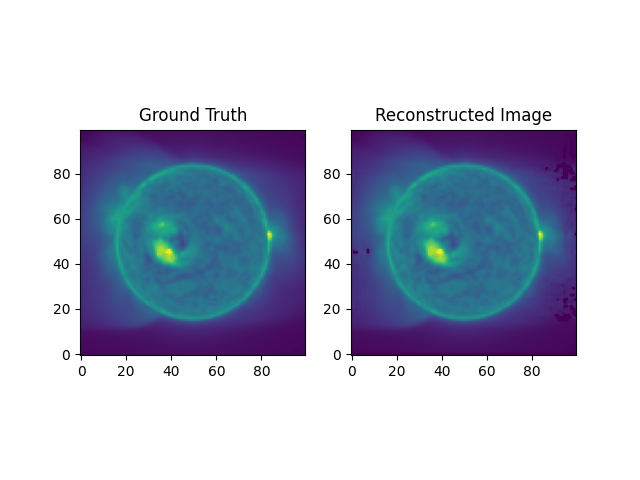

# TomograPy : A Python tomography package

## What is TomograPy ?

Tomography is the task of reconstructing a model based on observations. In this case, we use many 2D solar images to construct a 3D model of the solar environment.

This is a parallelized tomography projector and backprojector. It originates from solar tomography applications but could be used for other applications. It uses the [Siddon algorithm](https://aapm.onlinelibrary.wiley.com/doi/abs/10.1118/1.595715) as its core. The parallelization is done with Rust's Rayon library.

It was originally authored by [Nicolas Barbey](https://github.com/nbarbey) and is since updated and maintained by [Marcus Hughes](https://github.com/jmbhughes).



Above you can see an example input with its reconstruction from a TomograPy derived model cube. It's not perfect but shows the promise of this package.

## Status

This package still needs some features and much documentation to improve ease of use for solar physics settings. If you're interested in using it, please contact Marcus Hughes <marcus.hughes@swri.org> for more information on a timeline.

## Installation

Until the code is released on PyPI (coming soon!), you have to clone the repo and then install using pip. I always recommend creating a virtual environment for each project.

```bash
git clone git@github.com:nbarbey/TomograPy.git
python -m venv venv
source venv/bin/activate
pip install .
```

## Basic Use

Right now a simple toy example is available in `example.py`. More guidance is coming on how to use with STEREO and other data!

## Extended Documentation

Coming soon!

## Collaborations and questions

Please reach out to Marcus Hughes at <marcus.hughes@swri.org>. I'd love to have your input and use case in mind when developing this software.

## Citation

Please cite [the original paper](https://link.springer.com/article/10.1007/s11207-011-9792-8) until a Zenodo DOI is established for each release.

```bibtex
@article{barbey2013tomograpy,
  title={TomograPy: a fast, instrument-independent, solar tomography software},
  author={Barbey, Nicolas and Guennou, Chlo{\'e} and Auch{\`e}re, Fr{\'e}d{\'e}ric},
  journal={Solar Physics},
  volume={283},
  pages={227--245},
  year={2013},
  publisher={Springer}
}
```
